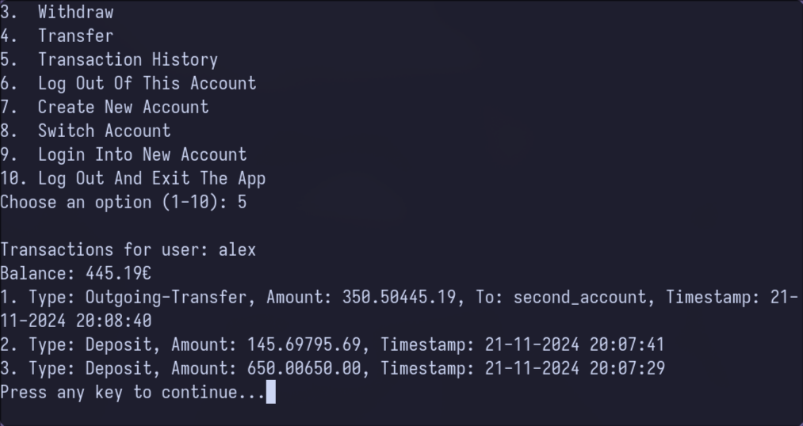

<h1 align="center">Bank.cpp 💳</h1>

> A console-based banking application written in C++


<div align="center" style="display: flex; justify-content: space-between; width: 100%;">
  
  
</div>

## Summary
This program provides a simple account management system that allows users to:
- 🛂 Log in to their account
- ✍️ Create new accounts
- 💵 Deposit, withdraw, and transfer money
- 📜 View transaction history

The program uses **SQLite** 🗄️ for managing user data and transactions and **libsodium** for securely hashing passwords 🔒.

## Features ✨
- 🔐 **User Authentication**: Secure password hashing and login verification.
- 💸 **Account Operations**: View balance, deposit, withdraw, and transfer money.
- 📝 **Transaction History**: View a record of account transactions.
- 🔑 **Account Management**: Create new accounts, log in and log out.
- ⛔ **Security**: Passwords are securely hashed using libsodium (argon2 algorithm), with protection against brute-force attacks via a lockout mechanism.

## Requirements 📋

To build and run this project, the following libraries are required:
- ⌨️ **C++17 or later**
- 📊 **SQLite3**: Used for storing user data and transaction details.
- 🔒 **libsodium**: Used for secure password hashing and verification.

### Installing Dependencies ⚙️
1. 🍃 **SQLite3**:
   - On Ubuntu:
     ```bash
     sudo apt-get install sqlite3 libsqlite3-dev
     ```
2. 🔒 **libsodium**:
   - On Ubuntu:
     ```bash
     sudo apt-get install libsodium-dev
     ```

## Compilation and Running 🚀

1. 🚪 Clone or download the repository.
2. ⚙️ Compile the C++ code using your preferred compiler (e.g., g++).
   
     ```bash
     g++ -o account_manager main.cpp -lsqlite3 -lsodium
