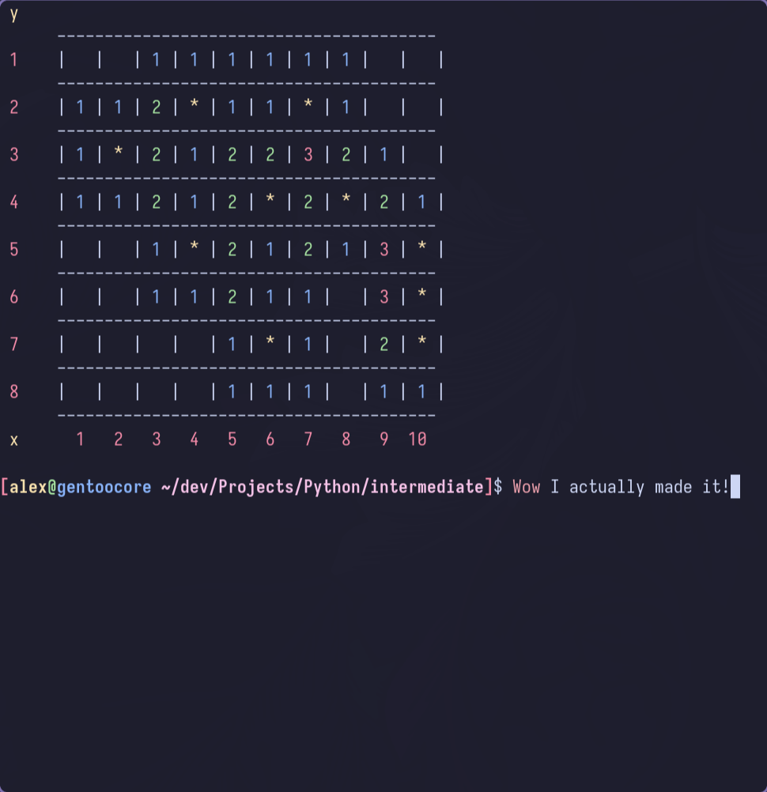

<h1 align="center">Minesweeper.py</h1>

> A simple CLI clone of the classic **Minesweeper** game written in Python. 



## Features

- 🟢 Simple CLI interface for playing Minesweeper.
- 🔴 Game grid displays and allows tile uncovering.
- ⚠️ Mine placement and flagging functionality.

## Installation

Clone the repository and run the Python script:

```
cd minesweeper
python minesweeper.py
```
